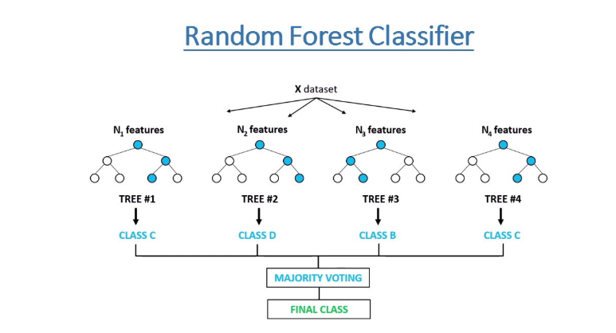

# Random Forest Classifier Model

In random forests (see RandomForestClassifier and RandomForestRegressor classes), each tree in the ensemble is built from a sample drawn with replacement (i.e., a bootstrap sample) from the training set.

Furthermore, when splitting each node during the construction of a tree, the best split is found either from all input features or a random subset of size max_features. (See the parameter tuning guidelines for more details).

The purpose of these two sources of randomness is to decrease the variance of the forest estimator. Indeed, individual decision trees typically exhibit high variance and tend to overfit. The injected randomness in forests yield decision trees with somewhat decoupled prediction errors. By taking an average of those predictions, some errors can cancel out. Random forests achieve a reduced variance by combining diverse trees, sometimes at the cost of a slight increase in bias. In practice the variance reduction is often significant hence yielding an overall better model.[1]

### Classification metrics

- Accuracy score:   0.9091
- Precision score:  0.5139
- Recall score:     0.7400
- F1-score:         0.6066

Confusion matrix:

|     | Predicted Negative | Predicted Positive |
|-----|--------------------|--------------------|
|Actual Negative |        443         |         35          |
|Actual Positive |         13         |         37          |
